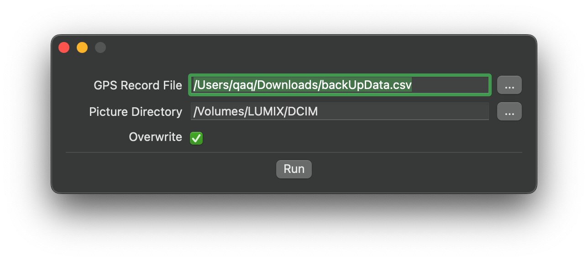

# Fix GPS

说来话长，之前写过一个 Command Line 工具，然后在系统更新以后编译的工具链出了点问题，具体来说引用的 Objective-C 代码没有被正确启用，不想追查就只好写个 app。

如果你有 https://apps.apple.com/us/app/footprint-record-lifes-path/id1225520399 这个 app，那你可以从设置里面导出定位记录，并正确填写文件位置即可。

---

砍砍 @ 2023.11.3
